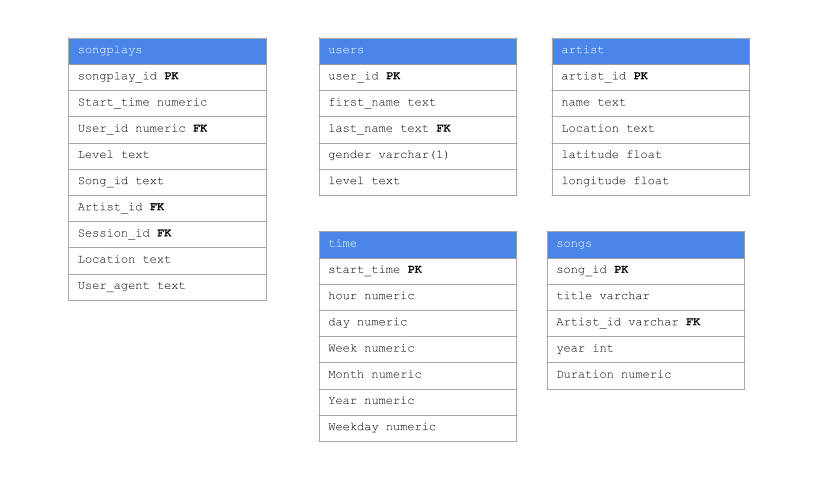

# Sparkify DB

A startup called Sparkify wants to analyze the data they've been collecting on songs and user activity on their new music streaming app. The analytics team is particularly interested in understanding what songs users are listening to. Currently, they don't have an easy way to query their data, which resides in a directory of JSON logs on user activity on the app, as well as a directory with JSON metadata on the songs in their app.

# Run
1. run `python create_tables.py`
2. run `python etl.py`

# The `What`

The `create_tables.py` contains SQL queries that 'CREATE', 'INSERT', '"SEARCH & FETCH"' for the data to be analyze

The python notebooks on the directory where use as a playground to test, build, and vizualize the proper data and functions for the etl.py process

